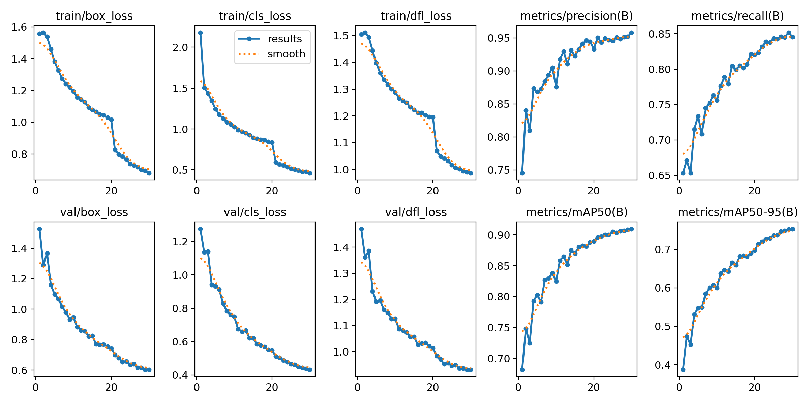
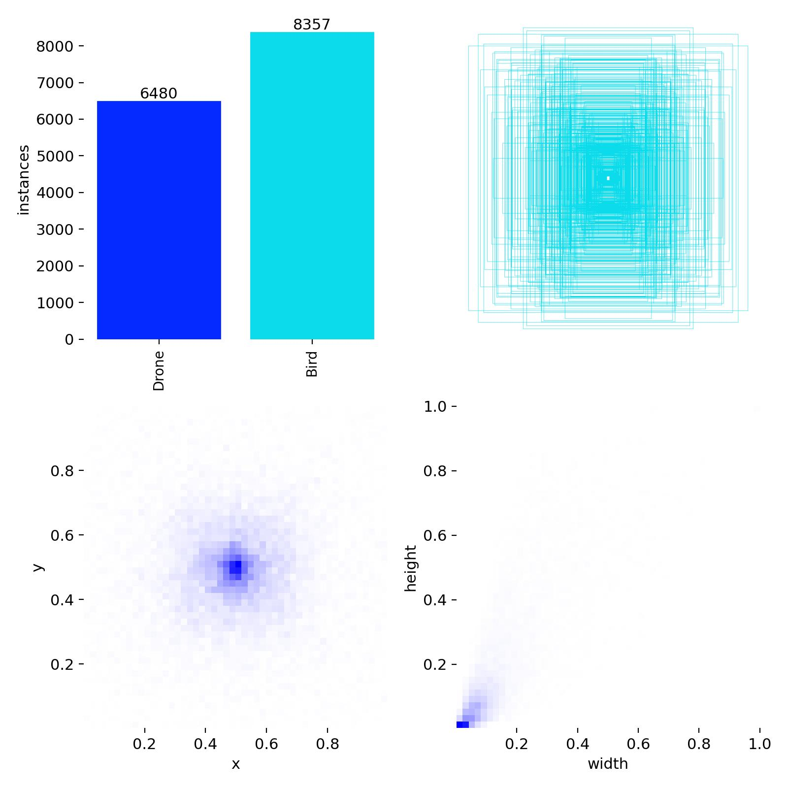
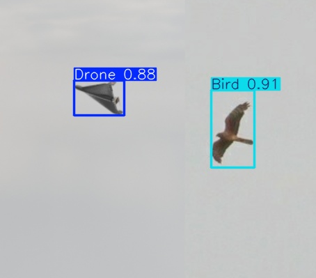

# Drone_vs_Bird
Отже, тут я використовуватиму свій датасет, детальніше про нього можна прочитати на на його сторінці в Kaggle:
https://www.kaggle.com/datasets/romsham/dronevsbird-foryolo

В датасет складається з 4 папок: images_drones, images_birds, labels_drones, labels_birds.

lables мають імена ідентичні іменам зображень.

## Про програму і модель
В програмі я розділяю дату на 3 частини train - val - test.
Для того, аби при розділені не було перекосу в сторону якогось з класу, я роблю це окремо для кожного з 2 класів, після чого об'єдную їх в спільний train_im - для зображень, train_lb - для міток. Те саме зроблено і для val, test.

Взагалі, це можна було б зробити, коли я створював датасет, і з часом я скоріш за все так і зроблю. Але в данний момент, я працював з кодом, що використовував в DroneDetect і там, імпорт і розділення були майже готові, тож я його по мінімуму переробив. 

Я зупинився на моделі yolov8n, адже вона швидка, легка і доволі точна, а я планую в майбутньому інтегруввати її в якийсь проект з робототехніки, тож використовувати більшу не має сенсу. 
### Структура програми:
   Імпорт данних -> Розілення їх на train - val - test -> запис їх в папки -> створення yaml -> визначення параметрів і навчання моделі  -> перевірка моделі на тренувальних данних

## Про detect.py
Це та сама програма, що я використовував і в DroneDetect.

Все що вона робить - це приймає шлях до файлу який треба передбачити і виводить передбачення.

## Результати тестування

На графіках видно, що модель за 30 епох не ще не досягла збіжності.

============================================================================================

Тут ми можемо побачити невеликий дисбаланс в класах, але для детекції це зазвичай не проблема. Також, тут видно, що в датасеті об'єкти мають маленькі бокси

## Передбачення

З цього передбачення видно, що модель чітко розрізняє дрон і птаха

============================================================================================

З цієї гіфки добре видно, що модель починає плутатисб і детектити дрон, як пташку, коли в кадр потрапляють гілки. Я думаю, це через те, що в даті багато зображень де птахи на гілках. Аби це виправити, можна видалити всі зображення з птахами на гілках, і доповнити датасет синтетичними данними.

## Початок роботи
1) Завантажте датасет за допомогою download_dataset.py
2) Запустіть програму для навчання моделі d_model_yolo.py (вкажіть свої шляхи до датасету)
3) Запустіть програму детекції detect.py(вкажіть власний шлях до параметрів моделі)

